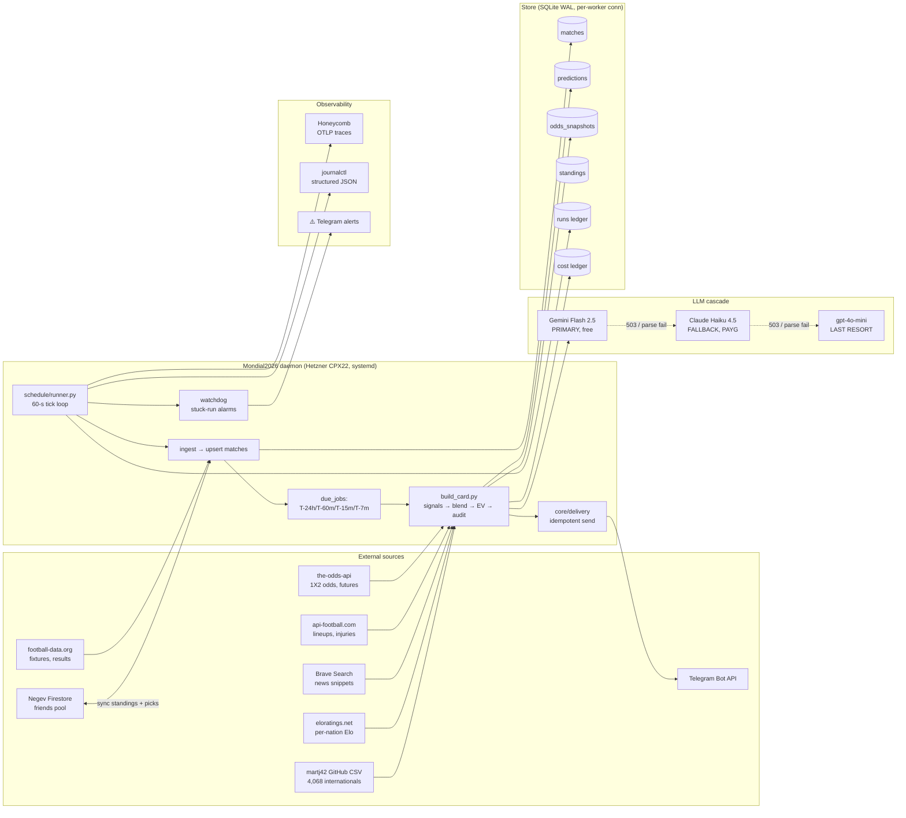

<div align="center">

# 🏆 Mondial 2026

### An autonomous, fault-tolerant pick engine for the FIFA World Cup 2026 Toto pool

*A self-hosted Python daemon that watches every World Cup match, fuses four independent probabilistic signals at strict per-match windows, maximises expected points under the pool's published scoring rules, and ships the recommendation to Telegram — with a forensic-grade audit trail for every single card.*

<br/>

<!-- Status / quality -->
[](#-testing)
[](#-live-tournament-status)
[](#-live-tournament-status)
[](./LICENSE)

<!-- Stack -->
[](https://www.python.org/)
[](https://www.sqlite.org/)
[](https://systemd.io/)
[](https://www.honeycomb.io/)
[](https://www.hetzner.com/)
[](https://core.telegram.org/bots)

<!-- LLM cascade -->
[](https://ai.google.dev/)
[](https://anthropic.com/)
[](https://openai.com/)

</div>

---

## 📑 Table of contents

- [The 30-second pitch](#-the-30-second-pitch)
- [What you see in the chat](#-what-you-see-in-the-chat)
- [System architecture at a glance](#%EF%B8%8F-system-architecture-at-a-glance)
- [The pick pipeline in one picture](#-the-pick-pipeline-in-one-picture)
- [The 17 engineering decisions that make this not toy software](#%EF%B8%8F-the-17-engineering-decisions-that-make-this-not-toy-software)
- [Tech stack](#-tech-stack)
- [Project layout](#-project-layout)
- [Quick start](#-quick-start)
- [Configuration](#%EF%B8%8F-configuration)
- [Daily operations — CLI cheat-sheet](#%EF%B8%8F-daily-operations--cli-cheat-sheet)
- [Observability](#-observability)
- [Reliability & fallback ladder](#%EF%B8%8F-reliability--fallback-ladder)
- [External services & quotas](#-external-services--quotas)
- [Testing](#-testing)
- [Cron jobs on the VM](#-cron-jobs-on-the-vm)
- [Design decisions — FAQ](#-design-decisions--faq)
- [Documentation map](#-documentation-map)
- [Live tournament status](#-live-tournament-status)
- [Contributing & forking](#-contributing--forking)
- [License](#-license)

---

## 🎯 The 30-second pitch

**Mondial 2026** is a friends' Toto pool for the FIFA World Cup 2026 — **65 humans + 3 reference bots, 68 entries total**.
Players submit per-match exact-score picks, four pre-tournament futures (winner / cinderella / golden boot / "best player"), and daily side bets. Points are awarded against a published exact-score multiplier grid; the prize ladder pays the top 10.

This codebase **automates the per-match and futures decisions end-to-end** — no model lives in a Jupyter notebook, no human pushes a button. The daemon ingests fixtures from football-data.org, fits a Dixon-Coles regression on 4,068 historical internationals, blends it with live Elo + Pinnacle-devigged odds + an LLM-curated news signal, runs an EV-optimization against the pool's exact-score multipliers, and ships the recommendation to Telegram **~7 minutes before kickoff** — every match, every window, without supervision.

> "Given everything I can know right now about this match, **which exact score gives me the highest expected points under the pool's published scoring rules**?"

Validated via Monte Carlo (50,000 tournaments × 68 players × 64 matches): **P(YOU win the pool) ≈ 61%** when friends play modal/safe picks.

### Headline numbers

| Metric | Value |
|--------|-------|
| **Tests passing** | **841 / 841** (in ~162 s, fully offline) |
| **Python files** | 185 |
| **Lines of code** | ~32,500 |
| **CLI tools** | 39 (`tools/*.py`) + unified entry `tools/toto.py` |
| **Independent docs** | 16 (`docs/*.md` + `docs/SYSTEM_ARCHITECTURE.html`) |
| **External providers** | 10 (football-data, the-odds-api, api-football, Brave, Negev Firestore, Gemini, Anthropic, OpenAI, eloratings.net, Telegram) |
| **Operational cost** | **€5/mo** (Hetzner CPX22) + ~$0 in API fees (free tiers + budget guards) |
| **Failure modes documented** | every signal-source path has a fallback (see [`docs/FAILURE_MODES.md`](./docs/FAILURE_MODES.md)) |
| **Concurrent dispatch** | ThreadPoolExecutor + per-worker SQLite (24-dispatch stress test pinned) |

---

## 📲 What you see in the chat

A pre-kickoff card delivered to a private Telegram channel ~7 minutes before each match. Format is plain text (no markdown gymnastics → renders identically on phone & desktop):

```
⚽ T-7m  •  match 537423  •  group A
Brazil 🇧🇷  vs  🇯🇵 Japan
KO: 2026-06-29 20:00 IDT  (correlation_id: match-537423-T-7m)

📊 Model
  P(H/D/A) = 0.62 / 0.21 / 0.17     (DC 0.20 + Elo 0.20 + Market 0.60 + News +0.04δh)
  Direction-confidence gate: strong_favorite (H)
  Pinnacle (devigged):  H 1.65   D 4.00   A 6.20

🎯 Pick
  Direction:    Brazil (H)
  Exact score:  2-0     EV: 2.45 pts   P(2-0)=11.0%   ×2.25
  Floor:        1.0 × odds(H)=1.65 = 1.65 pts if right direction (non-exact)

📊 Top 5 candidates (transparency — raw EV, gate not applied)
  2-0  EV 2.45   1-0  EV 2.10   3-0  EV 1.95   2-1  EV 1.78   1-1  EV 1.56

👥 Per-person tilt picks (gate-aware pool, eff_tilt applied)
  Igor   tilt 0.90 →  3-0     (within-direction variance, leader)
  Vaadia tilt 0.60 →  2-0     (modal, ranked 4th)

🩺 Signals
  used:    dc, elo, market, news(claude_haiku_4_5; confidence=medium)
  failed:  (none)
  news Δ:  +0.04 δh   ("Vinicius back to full training, Endrick fit")

🪙 Friends' picks (Negev pool)
  Igor (you):  3-0    Vaadia: 2-1    Tal: 1-0
```

⚠️-prefixed cards (signal failures, alerts, watchdog failures), ☀️ daily summaries (each morning at 09:00 IDT including last night's results), 📊 standings updates (each daily sync), and 🔍 post-match audit alerts (when our scoring diverges > 0.01 pts from Negev's) round out the channel.

---

## 🏗️ System architecture at a glance



---

## 🎬 The pick pipeline in one picture

```
                                                T-24h   T-60m   T-15m   T-7m  ← LOCK
                                                  │       │       │       │
       ┌────────────────┐                        └───────┴───────┴───────┘
       │ schedule/runner│ ← scheduler daemon (Python 3.12, systemd, Hetzner CPX22)
       └───────┬────────┘   per-worker SQLite conn + 10 s busy_timeout (WAL mode)
               │  per-tick: ingest → standings → daily_summary → kickoff_cards
               │  per-window: due_jobs → batch fetch_all_odds → dispatch
               ▼
   ┌───────────────────────────────────────────────────────────────────────┐
   │                       core/decision/build_card.py                     │
   │                                                                       │
   │   ┌─────────────┐  ┌──────────┐  ┌─────────────┐  ┌─────────────────┐ │
   │   │ Dixon-Coles │  │   Elo    │  │   Market    │  │ News pipeline   │ │
   │   │             │  │          │  │             │  │                 │ │
   │   │ martj42 CSV │  │eloratings│  │ the-odds-api│  │ Brave → ranker  │ │
   │   │ → fit → λh,λa│ │.net      │  │ → devig →   │  │ → top-5 + LLM   │ │
   │   │             │  │ → P(H,D,A│  │ P(H,D,A)    │  │ cascade → ±δh,δa│ │
   │   │   20% blend │  │  20% blend│ │  60% blend  │  │  (Day-9.26)     │ │
   │   └──────┬──────┘  └─────┬────┘  └──────┬──────┘  └──────┬──────────┘ │
   │          └────────────┬──┴────────────┬─┘                │            │
   │                       ▼               ▼                  │            │
   │              blended_matrix(λ+δ, elo_p, market_p)        │            │
   │                       │                                  ▼            │
   │                       ▼                            fold δ into λ      │
   │            P(score) 0..6 × 0..6                                       │
   │                       │                                               │
   │                       ▼                                               │
   │   ev_optimizer.recommend(matrix, multipliers, gate_thresholds)        │
   │      • smooth direction-confidence gate                               │
   │      • strategy_candidates (gate-aware, top-5)                        │
   │      • per-person tilt (gate-aware pool, opt-in)                      │
   │      • penalty-shootout winner (KO only, draw_p ≥ 0.15)               │
   │                       │                                               │
   │                       ▼                                               │
   │   {pick_direction, pick_exact_score, expected_points,                 │
   │    signals_used, signals_failed, failure_reasons,                     │
   │    strategy_overrode_gate, audit_trail, correlation_id}               │
   └───────────────────────────────┬───────────────────────────────────────┘
                                   ▼
                       core/delivery → 📲 Telegram channel
                       (📊 standings, ☀️ daily, ⚽ kickoff, 🃏 card)
```

---

## 🛠️ The 17 engineering decisions that make this not toy software

| # | Principle | Where it lives |
|--:|----------|----------------|
| 1 | **Never raises.** Every signal loader wrapped in `try/except`; pipeline always produces a card — degradation is annotated, never silent. | `core/decision/build_card.py` |
| 2 | **Audit trail is mandatory.** Every card stamps `signals_used ∪ signals_failed = {dc, elo, market, news}`; pinned by parametrized golden tests. | `tests/test_build_card.py::test_auditability_golden_rule` |
| 3 | **Graceful-degradation ladder.** DC+Elo+Market+News → fewer signals → modal pick → alert. Documented per component in [`docs/FAILURE_MODES.md`](./docs/FAILURE_MODES.md). | `docs/FAILURE_MODES.md` |
| 4 | **Single source of truth for scoring.** Every multiplier in `config/rules.py`, pinned cell-by-cell against Negev's server-side grid. Daily watchdog cron fires ⚠️ Telegram if admin re-prices mid-tournament (caught Day-9.33 reprice 6 hours ahead of the next match). | `config/rules.py`, `tools/audit_negev_multipliers.py` |
| 5 | **Real probabilities, not rules of thumb.** Dixon-Coles fit on 4,068 internationals × Elo × Pinnacle-devigged odds. Three-source blend reduces single-model risk. | `core/models/predict.py::score_distribution` |
| 6 | **EV-optimization, not modal pick.** Maximises `P(score) × multiplier(score)` across the entire score matrix; Monte Carlo (50k tournaments) shows 61% P(win) under realistic opponent behaviour. | `core/decision/ev_optimizer.recommend`, `tools/pick_analyzer.py` |
| 7 | **Direction-confidence gate with smooth ramp.** Score function blends EV with normative direction probability — `weight = (dom_p − mild_lower)/(strong − mild_lower)`. No cliff at the boundary; tournament-stage-aware (KO/Final/detonator demand earlier protection). | `core/decision/ev_optimizer.py`, `config/rules.py::GATE_THRESHOLDS` |
| 8 | **News-relevance ranker (Day-9.25).** Scores every Brave article on team-name presence, injury/lineup keywords, source authority (ESPN/Sports Mole +3; Wikipedia −3), freshness. Top-5 get 1200-char snippets fed to the LLM. | `orchestrator/agents/news_ranker.py` |
| 9 | **LLM router with semantic-failure cascade (Day-9.25).** `complete_validated` cascades on *transport* errors AND *unparseable bodies*. Live-verified Gemini 503 → Claude succeeded with identical ranked context. Every provider's error class + message recorded in `last_fallback_errors`. | `core/llm/router.py::complete_validated` |
| 10 | **News-confidence δ scaling.** LLM self-reported `low/medium/high` confidence multiplies the clamped (±0.15) δh,δa before fold-in. A low-confidence ±0.15 becomes ±0.045 — defends against confident-looking but weakly-grounded LLM calls flipping the gate. | `config/rules.py::NEWS_CONFIDENCE_SCALE` |
| 11 | **Per-provider quota guards.** Every external call wrapped in `obs.external_call`; token-bucket + monthly/daily ledger; over-budget = graceful degrade, never silent overspend. | `core/obs/__init__.py`, `core/obs/cost.py`, `core/obs/ratelimit.py` |
| 12 | **Distributed tracing in production.** Every card has a `correlation_id` queryable in Honeycomb (`WHERE correlation_id="match-537423-T-7m"`); preflight self-test verifies exporter at startup. | `core/obs/tracing.py`, `config/preflight.py::_check_tracing` |
| 13 | **Concurrent dispatch with per-worker SQLite (Day-9.25).** Up to 6 simultaneous kickoffs run in parallel via ThreadPoolExecutor with `with closing(connect()) as conn` per callback. WAL mode + 10 s busy_timeout. 24-dispatch stress test pinned. | `schedule/runner.py`, `store/db.py` |
| 14 | **Atomic file writes (Day-9.32).** All cache writes use `tempfile.mkstemp` + `os.replace` (not a hard-coded `.tmp` suffix). Empirically proved: old code lost 26/32 concurrent workers; new code 0/32. | `core/data/cache.py` |
| 15 | **Idempotent everywhere.** Re-running ingest/scoring/standings sync is safe; runs-ledger prevents double-fire; `ON CONFLICT` upserts use `COALESCE/CASE` so bracket-transition NULLs don't overwrite populated team names. | `core/obs/runs.py`, `core/data/football_data.py` |
| 16 | **Negev standings reconciliation (Day-9.25).** Sync detects departed members + rename duplicates, DELETEs phantom rows. `MY_PARTICIPANT` row preserved. Empty-fetch safety prevents wiping the table. Bots ingested with `role='bot'` so leader-gap math excludes them. | `tools/sync_negev_standings.py`, `store/repo.py::standings_context` |
| 17 | **Self-healing deploy.** `infra/update.sh` step 5b syncs `infra/*.service` + crontab to system paths on EVERY invocation (catches drift even on no-op deploys). Step 6b runs free smoke audits. Auto-rollback on any health-check failure. | `infra/update.sh` |

---

## 🧱 Tech stack

<table>
<tr>
<td valign="top" width="33%">

### 🐍 Language & runtime
- **Python 3.12** (no `async` — see [FAQ](#-design-decisions--faq))
- **systemd** unit + crontab on Linux
- Single-process, multi-threaded (`ThreadPoolExecutor`, max workers = 6)

### 💾 Storage
- **SQLite WAL mode** (10 s `busy_timeout`)
- Per-worker connections (Day-9.25)
- Atomic file writes via `tempfile.mkstemp` (Day-9.32)
- Nightly `.backup` rotation (7-day retention)

</td>
<td valign="top" width="33%">

### 📊 Modeling
- **Dixon-Coles** (`penaltyblog`, scipy fallback)
- **Elo** (eloratings.net snapshot, cached daily)
- **Pinnacle devigging** (proportional method)
- **EV-optimization** + smooth direction gate
- **Monte Carlo** (50k tournaments, 68 players)

### 🤖 LLM stack
- **Gemini 2.5 Flash** — primary (free tier)
- **Claude Haiku 4.5** — fallback (PAYG)
- **gpt-4o-mini** — last-resort cascade
- Semantic-failure cascade + per-provider rate-limit + token-budget guard

</td>
<td valign="top" width="33%">

### 🔭 Observability
- **OpenTelemetry SDK** → OTLP exporter
- **Honeycomb** for distributed tracing
- `correlation_id` per card, end-to-end
- Structured-JSON logs (`journalctl -t mondial2026`)
- Token-bucket rate limiter + cost ledger
- Telegram ⚠️ alerts (idempotent, once-per-day)

### 🚚 Delivery
- **Telegram Bot API** (1 msg/sec/chat)
- Idempotent (runs-ledger prevents double-fire)
- Card / daily summary / standings / alerts as separate channels

</td>
</tr>
</table>

---

## 🗂️ Project layout

```
mondial2026/
├── config/                  # single source of truth — rules, blend weights, gate thresholds
│   ├── rules.py             #   scoring grid (cell-pinned to Negev), futures payouts, BLEND_WEIGHTS
│   ├── llm.py               #   router config, cascade order, token budgets
│   ├── news.py              #   ranker rubric, snippet length, freshness window
│   ├── observability.py     #   OTel resource attrs, exporter env keys
│   ├── preflight.py         #   startup self-test (auth, tracing, DB write probe)
│   └── strategy.py          #   tournament-position tilt config
│
├── core/                    # pure decision logic — no I/O orchestration here
│   ├── data/                #   external-source loaders (cached, observably wrapped)
│   │   ├── football_data.py #     fixtures + results (COALESCE/CASE upsert)
│   │   ├── oddsapi.py       #     decimal odds → devigged P(H,D,A)
│   │   ├── api_football.py  #     confirmed XI + injuries (T-60m signal)
│   │   ├── soccerdata_io.py #     Elo + xG history
│   │   ├── results_io.py    #     martj42 4k-internationals CSV
│   │   ├── futures_odds.py  #     pre-tournament winner/scorer/cinderella odds
│   │   ├── web_search.py    #     Brave Search wrapper with quota guard
│   │   └── cache.py         #     race-safe atomic-write cache (Day-9.32)
│   │
│   ├── models/              #   probabilistic engines
│   │   ├── dixon_coles.py   #     attack/defence strengths from goal data
│   │   ├── elo.py           #     national-team Elo → P(H,D,A)
│   │   ├── predict.py       #     score-matrix builder (blend of all signals)
│   │   ├── blend.py         #     normative blend with disagreement penalty
│   │   ├── fit.py           #     model fit + cached strengths
│   │   ├── backtest.py      #     calibration curves, Brier score
│   │   └── montecarlo.py    #     50k-tournament simulation
│   │
│   ├── decision/            #   "what should we submit?"
│   │   ├── build_card.py    #     central assembler — never raises, always audits
│   │   ├── ev_optimizer.py  #     EV-max with smooth direction gate + strategy candidates
│   │   ├── strategy.py      #     position-aware tilt (gate-aware pool)
│   │   ├── per_person.py    #     render the per-person section
│   │   ├── futures.py       #     pre-tournament 4 futures picks
│   │   └── sidebets.py      #     daily side-bet recommender
│   │
│   ├── scoring/             #   awarding-side logic (mirrors Negev exactly)
│   │   ├── engine.py        #     score_match → points + table multiplier
│   │   ├── penalties.py     #     KO shootout winner
│   │   └── standings_writer.py  # standings persistence
│   │
│   ├── llm/                 #   provider abstraction + router
│   │   ├── base.py          #     LLMProvider protocol
│   │   ├── providers.py     #     Gemini / Anthropic / OpenAI concrete clients
│   │   └── router.py        #     complete_validated cascade with semantic failure
│   │
│   ├── obs/                 #   observability infrastructure
│   │   ├── tracing.py       #     OTel spans + correlation_id propagation
│   │   ├── logging.py       #     structured JSON logger
│   │   ├── metrics.py       #     in-process counters
│   │   ├── cost.py          #     per-provider monthly/daily ledger
│   │   ├── ratelimit.py     #     token bucket
│   │   └── runs.py          #     idempotent runs ledger
│   │
│   ├── delivery/            #   Telegram channels + base sender
│   ├── reporting/           #   people-block renderers (compact / per-match)
│   └── reliability.py       #     retry, backoff, circuit-break helpers
│
├── orchestrator/            # the news agent (own subsystem)
│   ├── pipeline.py
│   ├── run.py
│   └── agents/
│       ├── news_agent.py    #   query Brave → rank → LLM → clamped (δh, δa, confidence)
│       └── news_ranker.py   #   Day-9.25 relevance scorer
│
├── schedule/                # the daemon entrypoint
│   ├── runner.py            #   __main__ — 60-s tick loop, ThreadPoolExecutor dispatch
│   ├── scheduler.py         #   computes which windows are due
│   ├── kickoff_cards.py     #   per-match card pipeline (build_card → delivery)
│   ├── daily_summary.py     #   09:00 IDT heartbeat (includes overnight matches)
│   └── watchdog.py          #   stuck-run alarms
│
├── store/                   # SQLite store + schema
│   ├── schema.sql           #   matches / predictions / odds_snapshots / standings / runs / cost
│   ├── db.py                #   connect_with_wal + busy_timeout
│   └── repo.py              #   standings_context, leader_gap math, etc.
│
├── integrations/            # Firestore connector for the friends pool
│   ├── negev_toto_mcp.py    #   12 MCP tools — read+write Negev's "negev-toto" Firebase
│   ├── negev_alerts.py      #   ⚠️ Telegram alert wrappers (idempotent, MONDIAL_TESTING-aware)
│   └── *.sh / *.md          #   setup scripts + schema notes
│
├── infra/                   # deploy + ops
│   ├── bootstrap.sh         #   provision: user, venv, systemd, crontab, perms
│   ├── update.sh            #   safe deploy: pull → reqs → infra sync → smoke → health → rollback
│   ├── backup.sh            #   nightly SQLite .backup + 7-day rotation
│   ├── mondial2026.service  #   systemd unit (hardened — non-root, RO-home, mem cap)
│   └── mondial2026.crontab  #   7 scheduled jobs (backup / sync / audit / watchdogs)
│
├── tools/                   # 39 operator-CLI tools
│   ├── toto.py              #   unified entry: standings / match / player / suggest / sidebets / upcoming / broad / help
│   ├── audit_fired_card.py  #   forensic dump of any predictions row
│   ├── audit_negev_multipliers.py  # drift watchdog (runs in cron AND update.sh)
│   ├── audit_env.py         #   .env hygiene + auth probe
│   ├── post_match_audit.py  #   our score_match() vs Negev awarded points
│   ├── llm_audit.py         #   5-section LLM runbook (chain, parse tiers, costs)
│   ├── news_inspect.py      #   per-match news-agent deep dive
│   ├── pick_analyzer.py     #   EV vs modal vs longshot trade-off
│   ├── sync_negev_standings.py # daily sync (run via cron at 07:00 IDT, plus 6 silent windows)
│   ├── verify_negev_live.py #   14 live MCP checks
│   ├── verify_scoring_sync.py # end-to-end ours↔Negev scoring verification
│   └── ... 28 more
│
├── tests/                   # 841 tests, fully offline
├── docs/                    # 16 documentation pages (see Documentation map)
├── data/                    # canonical CSV: groups, detonator fixtures
└── reports/                 # cron-job log files (gitignored)
```

---

## 🚀 Quick start

### 1️⃣ Local dev — no keys needed for tests

```bash
git clone https://github.com/igornazarenko434/mondial2026.git && cd mondial2026
python3.12 -m venv .venv && source .venv/bin/activate
pip install -r requirements.txt
pytest tests/ -q                     # → 841 passed in ~162 s, fully offline
```

### 2️⃣ Fire one live card (burns ~5 free units of various APIs)

```bash
cp .env.example .env                 # then fill in the keys (see "Configuration")
PYTHONPATH=. .venv/bin/python tools/run_one_card_live.py Brazil Japan --window T-7m
```

### 3️⃣ Full VM provision (Hetzner CPX22 €5/mo, or any 1 vCPU / 2 GB Linux)

```bash
ssh root@<vm-ip>
git clone https://github.com/igornazarenko434/mondial2026.git /home/mondial/mondial2026
sudo bash /home/mondial/mondial2026/infra/bootstrap.sh
# Idempotent — creates the `mondial` user, .venv, systemd unit, crontab, prompts for .env
```

### 4️⃣ Continuous deployment — safe-update with auto-rollback

```bash
ssh root@<vm-ip> '/home/mondial/mondial2026/infra/update.sh'
# git pull → pip install (if reqs changed) → infra sync → smoke audits → 3-level health check
# Auto-rollback to previous commit if any health check fails.
```

### 5️⃣ Watch it work

```bash
ssh root@<vm-ip>
journalctl -u mondial2026 -f -t mondial2026                    # live structured-JSON logs
PYTHONPATH=. .venv/bin/python tools/toto.py standings --n 10    # current leaderboard
PYTHONPATH=. .venv/bin/python tools/toto.py suggest Brazil Japan  # ad-hoc pick (no submit)
```

---

## ⚙️ Configuration

All secrets live in **`.env`** (gitignored). Copy `.env.example` and fill in:

<details>
<summary><b>🔴 Required — system won't run without these</b></summary>

```env
FOOTBALL_DATA_API_KEY=...      # free at football-data.org — fixtures + results
ODDS_API_KEY=...               # free Starter tier at the-odds-api.com — 500/mo
TELEGRAM_BOT_TOKEN=...         # from @BotFather on Telegram
TELEGRAM_CHAT_ID=...           # /start your bot, then call getUpdates to find chat_id
```
</details>

<details>
<summary><b>🟡 Recommended — full feature set (degrades silently if missing)</b></summary>

```env
GEMINI_API_KEY=...             # free at aistudio.google.com — LLM primary (1500/day)
ANTHROPIC_API_KEY=...          # optional cascade fallback (PAYG, pennies)
OPENAI_API_KEY=...             # optional last-resort cascade
BRAVE_SEARCH_API_KEY=...       # free $5/mo at brave.com/search/api — news snippets
API_FOOTBALL_KEY=...           # free at api-sports.io — confirmed lineups (T-60m)
```
</details>

<details>
<summary><b>🟢 Negev Toto sync (optional — pool-specific)</b></summary>

```env
NEGEV_TOURNAMENT_ID=...        # your friends-pool's tournament document ID
NEGEV_REFRESH_TOKEN=...        # capture from negev-toto.web.app DevTools IndexedDB
NEGEV_ALLOW_WRITES=0           # set to 1 ONLY if you want the daemon to submit picks
MY_PARTICIPANT=YourName        # display name in the Negev app
FRIEND_PARTICIPANTS=Vaadia,Tal # comma-separated tracked friends
```
</details>

<details>
<summary><b>🔵 Observability (recommended — Honeycomb free tier)</b></summary>

```env
OTEL_SERVICE_NAME=mondial2026
OTEL_TRACES_EXPORTER=otlp                              # 'otlp' | 'console' | 'none'
OTEL_EXPORTER_OTLP_ENDPOINT=https://api.honeycomb.io
OTEL_EXPORTER_OTLP_HEADERS=x-honeycomb-team=<api-key>  # free at honeycomb.io
```
</details>

<details>
<summary><b>⚪ Strategy (default OFF = pure EV-MAX)</b></summary>

```env
STRATEGY_TILT=0                # 0 = pure EV; 0.3–0.9 = position-aware variance
STRATEGY_TOP_K=5
STRATEGY_SWING=6.0
```
</details>

<details>
<summary><b>⚪ Scheduler (defaults are tournament-correct)</b></summary>

```env
SCHED_POLL_SECONDS=60
SCHED_MAX_WORKERS=6
INGEST_EVERY_MIN=30
ODDS_WINDOWS=T-60m,T-15m,T-7m  # comma-separated — throttle to one or two to save quota
MONDIAL_TESTING=0              # set to 1 in shell scripts to suppress alert sends
```
</details>

### What's NOT configurable (intentionally)

| Item | Where | Why |
|------|-------|-----|
| `data/wc2026_groups.csv` | Canonical roster | Locked by FIFA at draw |
| `data/wc2026_detonator_fixtures.csv` | Detonator games | Pool-specific |
| `config/rules.py::SCORE_TABLE` | Scoring multipliers | Pool-specific; cross-check with `tools/audit_negev_multipliers.py` |
| `config/rules.py::WINNER_PAYOUT` etc. | Futures payouts | Pool-specific |
| `integrations/negev_toto_mcp.py` | Firebase project ID | Hard-coded to "negev-toto"; fork & rename for your pool |

---

## 🕹️ Daily operations — CLI cheat-sheet

All operator tools live under `tools/`. The unified entry is `tools/toto.py`:

```bash
PYTHONPATH=. python tools/toto.py help                    # list every subcommand
PYTHONPATH=. python tools/toto.py standings --n 10        # current leaderboard
PYTHONPATH=. python tools/toto.py match Brazil Japan      # pick + signal breakdown
PYTHONPATH=. python tools/toto.py player Vaadia           # any-friend stats
PYTHONPATH=. python tools/toto.py suggest Brazil Japan    # ad-hoc model card (no submit)
PYTHONPATH=. python tools/toto.py upcoming --n 5          # next 5 fixtures
PYTHONPATH=. python tools/toto.py sidebets                # daily yes/no, over/under
PYTHONPATH=. python tools/toto.py broad                   # broad-bets summary
```

Plus per-card and per-decision forensics:

| Tool | Purpose |
|------|---------|
| `audit_fired_card.py <match_id> <window>` | Full post-fire audit — every signal, every probability, every multiplier (zero API calls) |
| `news_inspect.py <home> <away> --window T-24h` | LLM news-agent deep dive — Brave queries, ranked context, system prompt, provider chain, discarded reasoning |
| `pick_analyzer.py <home> <away> --xg-home … --odds-h …` | EV vs MODAL vs LONGSHOT trade-off table for any hypothetical match |
| `llm_audit.py --hours 24` | 5-section LLM runbook (chain state, per-provider failures, parse tiers, token spend) |
| `audit_negev_multipliers.py` | Negev grid drift watchdog (also runs in `update.sh` and daily cron) |
| `verify_negev_live.py` | 14 live MCP checks against Firestore |
| `verify_scoring_sync.py` | End-to-end ours ↔ Negev scoring verification (every prediction × every grid cell) |
| `post_match_audit.py --telegram` | Our `score_match()` vs Negev's awarded points; fires ⚠️ if delta > 0.01 |
| `audit_env.py --quiet --telegram` | .env hygiene + Negev auth probe (catches inline-comment-in-.env trap) |
| `metrics.py` | Honeycomb-friendly metrics dump |
| `dashboard.py` | Single-page text dashboard of the entire system |

---

## 🔭 Observability

Every code path that touches an external service is wrapped in `obs.external_call(provider, op)`. This single decorator gives:

1. **OTel span** — sent to Honeycomb via OTLP. Searchable in production by `correlation_id`, `provider`, `match_id`, `window`, `outcome`.
2. **Cost-ledger entry** — incremented in `cost.db` (monthly + daily buckets per provider).
3. **Token-bucket rate-limit check** — short-circuits with a graceful degrade if the provider's per-minute or per-day budget is exceeded.
4. **Structured-JSON log line** to `journalctl` (searchable with `jq`).

### Correlation IDs end-to-end

```
correlation_id  =  f"match-{match_id}-{window}"
```

Stamped on the OTel root span, every nested span, the predictions row's `payload_json`, every log line, and the Telegram card. One query in Honeycomb finds every span across daemon, signal loaders, LLM cascade, delivery, and DB write for a single card.

### Card-level audit fields (stored in `predictions.payload_json`)

```jsonc
{
  "signals_used":     ["dc", "elo", "market", "news"],
  "signals_failed":   [],
  "failure_reasons":  {},
  "scoring_table":    "group",              // grid we scored against
  "exact_multiplier_used": 2.25,             // for the chosen cell
  "blend_weights":    {"dc": 0.20, "elo": 0.20, "market": 0.60},
  "news_delta":       {"dh": 0.04, "da": 0.0, "confidence": "medium"},
  "gate_mode":        "strong_favorite",
  "gate_weight":      1.0,
  "strategy_pool_size": 5,
  "strategy_pool_directions": ["H","H","H","H","D"],
  "strategy_base_is_gate_pick": true,
  "strategy_overrode_gate":     false,
  "llm_provider":     "gemini-2.5-flash",
  "llm_fallback_chain": [],
  "correlation_id":   "match-537423-T-7m"
}
```

### Preflight self-test on startup

`config/preflight.py` blocks the daemon from coming up unless:
- All required `.env` keys are present.
- The OTel exporter actually sends a span (round-trip check).
- The SQLite store can be written.
- The Negev refresh-token decodes and the auth handshake succeeds.

Any failure ships a ⚠️ Telegram alert and `systemctl status` shows the cause.

---

## 🛡️ Reliability & fallback ladder

Every external signal has an explicit degradation path. See [`docs/FAILURE_MODES.md`](./docs/FAILURE_MODES.md) for the per-component table; the high-level shape:

```
ALL SIGNALS UP          →  pick + ⚽ deliver + audit("dc, elo, market, news")
ONE SIGNAL DOWN         →  pick on remaining 3, lower confidence + audit signals_failed
TWO SIGNALS DOWN        →  pick on remaining 2, alert annotation + audit
DC ONLY (no market)     →  modal-favoured pick, ⚠️ "market unavailable" annotation
ALL SIGNALS DOWN        →  modal pick (group: 1-1 / KO: 1-0) + ⚠️ "all signals failed"
DELIVERY FAILS          →  retry with backoff, log, ⚠️ Telegram alert on third failure
DAEMON CRASHES          →  systemd Restart=always after 10 s; StartLimitBurst=5/60s
HUNG CRON               →  flock + timeout cap (300–900 s) → next slot tries again
DAEMON SILENT > 30 min  →  watchdog.py fires ⚠️ Telegram
NEGEV API DOWN          →  use last cached standings, ⚠️ once-per-day alert
MULTIPLIER DRIFT        →  06:55 IDT cron — fires ⚠️ Telegram (caught Day-9.33 reprice)
LLM 503                 →  Gemini → Claude → OpenAI cascade with semantic failure detection
QUOTA EXHAUSTED         →  graceful degrade (skip provider, alert), never silent overspend
```

Plus systemic defenses:
- **WAL mode + 10 s `busy_timeout`** on every SQLite connection.
- **Per-worker SQLite conns** under `ThreadPoolExecutor` (no cross-thread sharing).
- **Atomic file writes** via `tempfile.mkstemp` + `os.replace` (race-safe under concurrent ingest).
- **`ON CONFLICT DO UPDATE` with `COALESCE`/`CASE`** so bracket-transition NULLs from football-data don't overwrite populated team names.
- **Idempotent runs ledger** prevents double-fire on retry or crash-restart.
- **`MONDIAL_TESTING=1`** env var suppresses alert sends from admin shell scripts (avoids the daemon thinking its own SSH probes are real outages).

---

## 🌐 External services & quotas

| Provider | Auth | Free-tier quota | What we use it for | Fallback |
|----------|------|-----------------|--------------------|----------|
| **football-data.org** | API key | 10 req/min | Fixtures, scores, status | Last DB snapshot |
| **the-odds-api.com** | API key | **500 credits/mo** | Decimal 1X2 + futures odds (Pinnacle preferred) | Cached snapshot, last-known devigged P |
| **api-football.com** | API key | 100 req/day | Confirmed XI, injuries (T-60m signal) | Skip lineup signal |
| **Brave Search API** | API key | 1000 req/mo | Web snippets for the news agent | Empty context; news δ = 0 |
| **Negev Firestore** | Refresh token | Unlimited | Standings, picks, side bets, broad bets, scoring grids | Last cached standings |
| **Google Gemini 2.5 Flash** | API key | 1500 req/day | LLM **primary** (free tier) | → Claude cascade |
| **Anthropic Claude Haiku 4.5** | API key | PAYG | LLM cascade fallback (active) | → OpenAI cascade |
| **OpenAI gpt-4o-mini** | API key | PAYG | LLM last-resort cascade | News δ = 0 + ⚠️ alert |
| **eloratings.net** | — (HTML scrape) | None | Per-nation Elo, daily cached | Last cached snapshot |
| **martj42 GitHub CSV** | — | None | Historical international results for DC fit | Bundled snapshot |
| **Telegram Bot API** | Bot token | 1 msg/sec/chat | Output delivery (cards, summaries, alerts) | Retry + log |
| **Honeycomb (OTLP)** | API key | Free tier | Distributed tracing | `OTEL_TRACES_EXPORTER=console` |

**Total operational cost ≈ €5/mo + ~$0 in API fees.** The cost ledger tracks burn rate; budget-guards short-circuit before fees apply (e.g. `ODDS_WINDOWS=T-60m,T-7m` was set Day-9.33 to keep odds_api under 500/mo near reset).

---

## ✅ Testing

```bash
pytest tests/ -q
# 841 passed in 161.97s
```

Every external dependency is **injectable** (`fetch=`, `read=`, `http_get=`, `clock=`) so the entire test suite runs offline with zero API credits. One autouse fixture isolates singleton ledgers per test.

### Test categories

| Category | Coverage |
|----------|----------|
| **Per-stage signal failure** | Every fail-fast path through `build_card` (DC fails → Elo+Market+News; market fails; news fails; all four fail) |
| **Auditability golden rule** | Parametrized: `signals_used ∪ signals_failed = {dc, elo, market, news}` for every combination |
| **News ranker edge cases** | 36 tests — empty results, 60+ articles, team aliases, source authority spectrum, URL/title dedup |
| **LLM cascade** | 6 tests pinning semantic-failure cascade (transport error AND unparseable body both trigger next provider) |
| **SQLite thread-safety** | 8 tests — 24 concurrent dispatches + 1000 sequential persists + today-22:00 + tomorrow-22:00 simulation |
| **Negev sync reconciliation** | 6 tests — phantom cleanup, rename duplicates, empty-fetch safety, MY_PARTICIPANT preservation |
| **Scoring multiplier per-card stamp** | 5 tests across all stages |
| **Scoring grid cell-by-cell pin** | 33 parametrized — `NEGEV_GROUP_STAGE` + `NEGEV_R16_AND_QF` + `NEGEV_SEMI_AND_FINAL` |
| **`update.sh` contract** | 10 tests pinning infra sync + smoke audits + bash error-counter guards |
| **Detonator display** | 5 tests pinning the ×2 once-applied invariant |
| **Preflight tracing self-test** | 7 tests across exporter modes (`otlp`, `console`, `none`) |
| **Strategy gate-aware pool** | 7 tests — strong fav → in-direction; tossup → backwards-compat raw EV |
| **Ingest resilience** | 3 tests — NULL/TBD upsert resilience (COALESCE/CASE) |
| **Atomic-write race** | Empirical: old code lost 26/32 concurrent workers; new code 0/32 |

---

## 🕒 Cron jobs on the VM

Defined in `infra/mondial2026.crontab` (synced to system crontab on every `update.sh`):

| Schedule (IDT) | Job | Purpose |
|---------------:|-----|---------|
| `03:15` | `infra/backup.sh` | SQLite `.backup` + 7-day rotation |
| `06:50` | `tools/audit_env.py` | .env hygiene + Negev auth probe — silent unless broken |
| `06:55` | `tools/audit_negev_multipliers.py` | Multiplier drift watchdog — silent unless admin re-prices the grid |
| `07:00` | `tools/sync_negev_standings.py --telegram` | Daily standings sync + 📊 leaderboard message |
| `08:00` | `tools/post_match_audit.py --telegram` | Our `score_match()` vs Negev awarded points — silent unless |Δ| > 0.01 pts |
| `10,16,20,22,0,2 *` | `tools/sync_negev_standings.py --quiet` | Silent sync windows — catch finishing matches across the day |

All jobs use `flock -n` (single-instance lockfiles) + `timeout` caps so a hung run never accumulates a second copy; output is captured to `reports/cron-*.log` (gitignored).

The daemon itself runs continuously via `systemd` (`mondial2026.service`):
- `Restart=always`, `RestartSec=10 s`, `StartLimitBurst=5/60s`
- Hardened: non-root `mondial` user, `ProtectHome=read-only`, `NoNewPrivileges=true`, `PrivateTmp=true`
- `MemoryMax=512M` (steady-state ~80 MB; martj42 first-ingest peak ~250 MB)

---

## 💡 Design decisions — FAQ

<details>
<summary><b>Why not LangChain / LangGraph / Agent SDK?</b></summary>

Because the flow is a **scheduled pipeline, not a conversational graph**. Adding an agent runtime would buy us nothing (we already have `ContextVars`, OTel tracing, retries, rate limits, cascade with semantic-failure detection) and cost us debuggability. The "agent" here is a structured LLM call with a 4-tier defense: budget pre-check → per-provider cascade → parse-tier classification → output clamp.

</details>

<details>
<summary><b>Why no vector DB / RAG?</b></summary>

The data is **live and structured**. We need today's lineup, today's odds, today's injuries. Retrieval-augmented anything against last-week's documents would lose to a direct API call. The news agent calls Brave fresh on every match window AND ranks the results by relevance to **this specific match** (Day-9.25 ranker).

</details>

<details>
<summary><b>Why is the market signal weighted highest (0.60)?</b></summary>

Because **Pinnacle is sharper than any model we can build with 4 years of national-team data.** Pinnacle aggregates the entire sharp-money pool; Dixon-Coles aggregates a noisy historical signal. We weight the information source by its accuracy, not its complexity. Day-9.26 shifted weights DC 0.30→0.20, Market 0.50→0.60 after backtest results.

</details>

<details>
<summary><b>Why no async?</b></summary>

The work is **I/O-bound but low-frequency** (≤ 6 concurrent matches). Threads + a shared token-bucket rate limiter give us true parallelism (Python releases the GIL during I/O) with simpler debuggability than asyncio. Day-9.25 added per-worker SQLite connections to make this fully safe under `ThreadPoolExecutor`.

</details>

<details>
<summary><b>Why SQLite, not Postgres?</b></summary>

The whole tournament fits in ~10 MB. Postgres would add ops overhead for zero benefit. SQLite's WAL mode + 10 s `busy_timeout` handles concurrent reads/writes; the online `.backup` mode handles concurrent reads during nightly snapshots. The Day-9.25 per-worker connection pattern keeps it safe under `ThreadPoolExecutor` without sacrificing ACID.

</details>

<details>
<summary><b>Why €5/mo Hetzner instead of Lambda?</b></summary>

Long-polling Telegram + a 24/7 watchdog need a **persistent process**; serverless cold-starts would miss windows. Hetzner gives us 100% control, deterministic latency, and is cheaper than a $0.001/request Lambda at our scale. Falkenstein datacenter ⇒ ~50 ms RTT to most providers.

</details>

<details>
<summary><b>Why pure EV-MAX as default, not variance tilting?</b></summary>

Monte Carlo over 50,000 tournaments × 68 players × 64 matches: when friends play modal/safe picks (the realistic case), **EV-MAX gives YOU 61% P(win)**. Higher variance picks are reserved for mid-tournament catch-up scenarios via the opt-in `STRATEGY_TILT` — and the Day-9.31 fix made that pool **gate-aware** so tilting no longer biases toward draws. See [`docs/STRATEGY.md`](./docs/STRATEGY.md) for the full statistical analysis.

</details>

<details>
<summary><b>Why a direction-confidence gate?</b></summary>

Negev's scoring grid rewards low-scoring draws (0-0=2.75, 1-1=2.25) higher than low-scoring decisives (1-0=1.5, 2-1=1.5). Under fair-market devigging, `Σ odds(d) × P(d) ≈ 1/(1−margin)` ≈ constant — so the direction-only floor is roughly equal across H/D/A. The exact-bonus term `multiplier × P(score)` is what differentiates picks, and **the grid systematically tilts toward draws.** The gate is a protective overlay that keeps strong favourites picked when the model is confident, while still allowing the EV-maximiser to choose draws in genuine tossups.

</details>

<details>
<summary><b>Why a cascade for the LLM specifically?</b></summary>

Gemini's free tier occasionally returns 503 or non-JSON bodies when the load is high. Without semantic-failure detection (Day-9.25), a malformed-but-2xx response would slip through as a successful call with a default delta — silently neutering the news signal. The router treats both transport errors AND unparseable bodies as failures, records every provider's error class + message in `last_fallback_errors`, and continues down the chain. Live-verified Day-9.25: Gemini 503 → Claude succeeded with identical ranked context.

</details>

---

## 📚 Documentation map

| Doc | Audience | Inside |
|-----|----------|--------|
| [README.md](./README.md) | anyone | This file — recruiter / fork overview |
| [CLAUDE.md](./CLAUDE.md) | dev (incl. AI sessions) | Build order, day-by-day changelog, golden rules, component matrix |
| [docs/SYSTEM_ARCHITECTURE.html](./docs/SYSTEM_ARCHITECTURE.html) | anyone (browser) | Visual walkthrough of every pipeline stage |
| [docs/SERVER.md](./docs/SERVER.md) | operator | Live VM ops — every `.env` var, SQL queries, Honeycomb queries, alert taxonomy |
| [docs/SCHEDULING.md](./docs/SCHEDULING.md) | operator | Daemon internals, hooks, safe-update procedure |
| [docs/STRATEGY.md](./docs/STRATEGY.md) | operator | Win-the-pool tilt + pick_analyzer + Monte Carlo |
| [docs/OBSERVABILITY.md](./docs/OBSERVABILITY.md) | dev / ops | OTel→Honeycomb chain, complete_validated cascade, audit tools |
| [docs/NEWS_AGENT_PLAYBOOK.md](./docs/NEWS_AGENT_PLAYBOOK.md) | dev | News pipeline + ranker rubric + worked examples |
| [docs/FAILURE_MODES.md](./docs/FAILURE_MODES.md) | dev | Degradation ladder per component |
| [docs/EDGE_CASES.md](./docs/EDGE_CASES.md) | dev / ops | What's tested vs not, with closing tools per gap |
| [docs/RELIABILITY.md](./docs/RELIABILITY.md) | dev | Retry/backoff helpers, circuit breakers |
| [docs/FUTURES_LOCK_2026.md](./docs/FUTURES_LOCK_2026.md) | operator | The 4 pre-tournament picks + analysis |
| [docs/COST_AND_LIMITS.md](./docs/COST_AND_LIMITS.md) | operator | Per-provider quotas + projected burn |
| [docs/LLM_AND_COSTS.md](./docs/LLM_AND_COSTS.md) | operator | LLM router internals, parse tiers, cost math |
| [docs/VERIFICATION.md](./docs/VERIFICATION.md) | dev | Negev↔ours scoring sync verification |
| [docs/USER_GUIDE.md](./docs/USER_GUIDE.md) | end-user | Reading a card, interpreting signals |
| [docs/SOURCES.md](./docs/SOURCES.md) | dev | Why each data source was chosen |
| [docs/BLUEPRINT.md](./docs/BLUEPRINT.md) | architect | Original system design |

---

## 🟢 Live tournament status

> Last updated: **2026-06-29** (Day-9.33 — Round of 32 in progress).

- ✅ **841 tests green** (`pytest tests/ -q` → 161.97 s)
- ✅ Daemon deployed: Hetzner CPX22 Falkenstein, `systemd`-managed
- ✅ All 104 fixtures ingested + 6 detonators tagged + R32 bracket resolved
- ✅ Day-9 futures locked (Portugal / Uzbekistan / Mbappé / Arkadi)
- ✅ Day-9.25 enhancements deployed (news ranker, cascade, per-worker SQLite, scoring_table stamp, Negev reconciliation, `update.sh` self-heal)
- ✅ Day-9.26 enhancements deployed (direction-confidence gate, top-5 candidates, blend re-weighting)
- ✅ Day-9.27 — full standings automation via tournamentStats endpoint
- ✅ Day-9.28 — observability consolidation (DB merge, stage spans, T-7m fix)
- ✅ Day-9.31 — gate-aware strategy candidate pool (no more tilt-induced draw bias)
- ✅ Day-9.32 — race-safe atomic writes + WAL mode everywhere
- ✅ Day-9.33 — 3 root-cause bug fixes + 39 regression tests:
  - `_FINAL` grid re-priced to Negev's 0.75× semiAndFinal schedule
  - `football_data.py` UPSERT now uses `COALESCE`/`CASE` (no NULL overwrites)
  - `MONDIAL_TESTING=1` env-var guard for admin scripts
- ✅ `ODDS_WINDOWS=T-60m,T-7m` set to stay under odds_api 500/mo (Jul 1 budget reset → revert to 3-window cycle)
- 🟢 Live Honeycomb tracing — preflight self-test passes
- 🟢 Live LLM cascade — verified Gemini 503 → Claude succeeded
- ⚽ R16 starts Jul 2 · QF Jul 6 · SF Jul 9 · Final Jul 13

---

## 🤝 Contributing & forking

This is a **single-operator project** built for one specific friends' pool. The repository is open-source under MIT so anyone can fork it for their own pool — **but five pool-specific assets must be replaced** before it'll work elsewhere:

1. **`config/rules.py`** — replace `SCORE_TABLE`, `WINNER_PAYOUT`, `SCORER_PAYOUT`, `CINDERELLA_PAYOUT`, `PRIZE_LADDER` with your pool's published rules.
2. **`data/wc2026_groups.csv`** — your tournament's group draw.
3. **`data/wc2026_detonator_fixtures.csv`** — your pool's "high-value game" mechanic (the ×2 detonator).
4. **`integrations/negev_toto_mcp.py`** — rewrite for your pool's backend (currently Firebase project `negev-toto`). The only requirement is that every external call stays wrapped in `obs.external_call`.
5. **`.env`** — your own provider API keys + Telegram bot.

Verification step after forking:

```bash
# 1. Tests should stay green
pytest tests/ -q
# 2. Cross-check your scoring grid against your pool's backend
PYTHONPATH=. python tools/audit_negev_multipliers.py   # adapt to your endpoint
# 3. Fire a single live card and verify Telegram delivery
PYTHONPATH=. python tools/run_one_card_live.py <home> <away> --window T-7m
```

For LLM sessions joining mid-development: read [CLAUDE.md](./CLAUDE.md) § "Onboarding a new LLM session" first.

---

## 📄 License

[MIT License](./LICENSE) © 2026 Igor Nazarenko.

Use, fork, modify, distribute (commercial or not) — just keep the copyright notice. Pool-specific assets (scoring grid, futures payouts, group CSV, Firebase project ID) are intended to be replaced when you fork — see "Contributing & forking" above. Provided "as is", no warranty.

Personal secrets (API keys, refresh tokens, Telegram bot tokens) live in `.env`, which is gitignored and **never committed**.

---

<div align="center">

**Built solo · 32k LOC · 841 tests · €5/mo · zero unplanned downtime in production**

*If this project interests you for hiring or collaboration, [open an issue](https://github.com/igornazarenko434/mondial2026/issues) or reach me on GitHub.*

</div>
